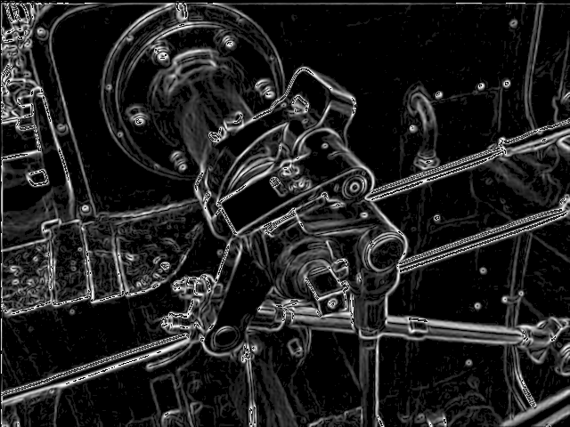
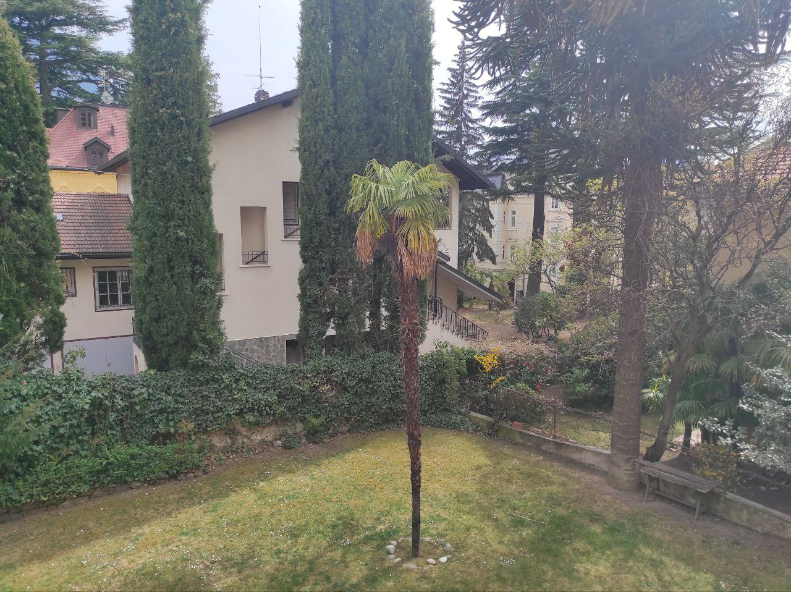
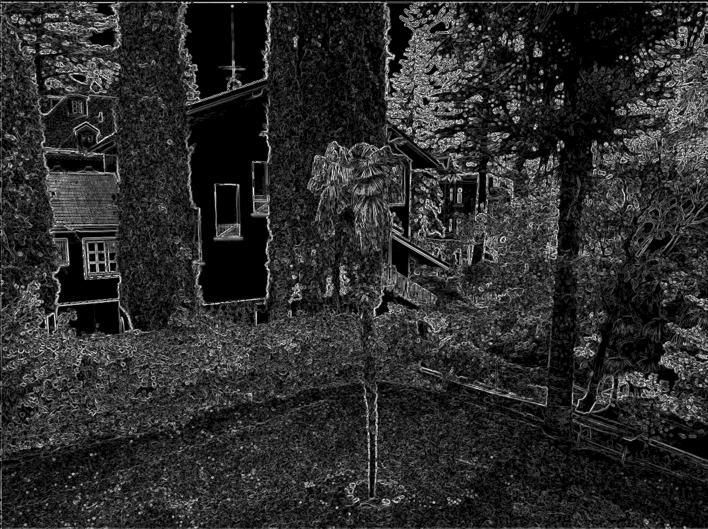
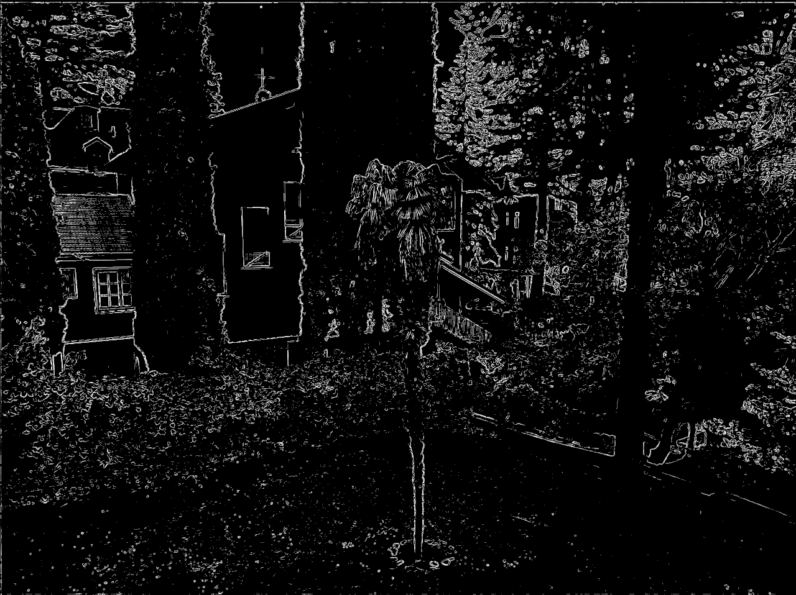

# SobelGradient

This is a minimal implementation of Sobel Gradient. It has only one dependency: lodepng to load and write png files.
The code is organized in the following way:
- algorithms: contains the implementation of sobel convolution
- types: contains all type definition useful to perform sobel convolution
- lib: contains external libraries (only lodepng)

<h1>
  Parameters
</h1>

Only 2 parameters are used in this implementation:
- threshold: user-defined value to control how steep the gradient magnitude should be to be considered as an edge in the image
- smoothing: boolean parameter to control if the image should be smoothed before the application of the Sobel filter. Smoothing can be used to reduce noise
in the resulting image

<h1>
  Algorithm Logic
</h1>

The algorithm works following these steps:
- the image is loaded from the path given using lodepng library, which returns a vecotr of RGBA pixels
- the RGBA pixels are organized in a matrix structure, that is a matrix in which every entry is represented by a custom type called RGBA, that is just
a group of four integers representing red, green, blue and transparency of the pixels
- the RGBA matrix is converted in a grayscale matrix (meaning a matrix in which every entry is just a single value)
- the grayscale matrix is the smoothed if the corresponding parameter is set to True
- the sobel operator is applied (both in x and y direction) to the grayscale matrix 
- values resulting from the application of the Sobel operator are filtered based on the threshold value specified by the user
- grayscale matrix is converted back to a vector of RGBA pixels in order to use lodepng to save a .png image

<h1>
  Guide and Example
</h1>

The algorithm can be used by creating an instance of the SobelGradient class, passing threshold value and smoothing requirement, and calling the Apply method. To save the resulting image one just needs to call the Save method and pass it the saving path, with output image name and .png extension (I did not add any type of check for
file extension or save path). An example code snippet is shown below:

```C++
std::string inputPath = 'my/input/path.png';
std::string outputPath = 'my/output/path.png';
auto gradient = cv::algorithms::SobelGradient(inputPath, 50, true);
gradient.Apply();
gradient.Save(outputPath);
```

An example of usage is given in the main.cpp file, where both the loading and the saving path are left blank.

<h1>
  Results
</h1>

To show the results that this implementation can produce, I'm comparing an example taken from wikipedia to the result that my algorithm can give.
The following image is taken from the Sobel operator wikipedia page (<a href="https://en.wikipedia.org/wiki/Sobel_operator">Sobel operator</a>):


and below the result of the application of the Sobel operator taken from wikipedia (left) is compared to the result that my implementation is able to produce (right):

Sobel operator wikipedia result             |  Sobel operator this implementation result
:-------------------------:|:-------------------------:
  |  

The result presented above in the image to the right, was obtained with a threshold of 20 and a pre-smoothing of the image.

Another result of this algorithm is presented, where the image given as the input of the algorithm is a photo taken with my smartphone and shown below:



and two resulting images were produced, one with threshold 20 (left) and the other one with threshold 100 (right):

Sobel operator with threshold 20             |  Sobel operator with threshold 100
:-------------------------:|:-------------------------:
  |  

<h1>
  Dependencies
</h1>

As already mentioned the only dependency is <a href="https://github.com/lvandeve/lodepng">lodepng</a>
